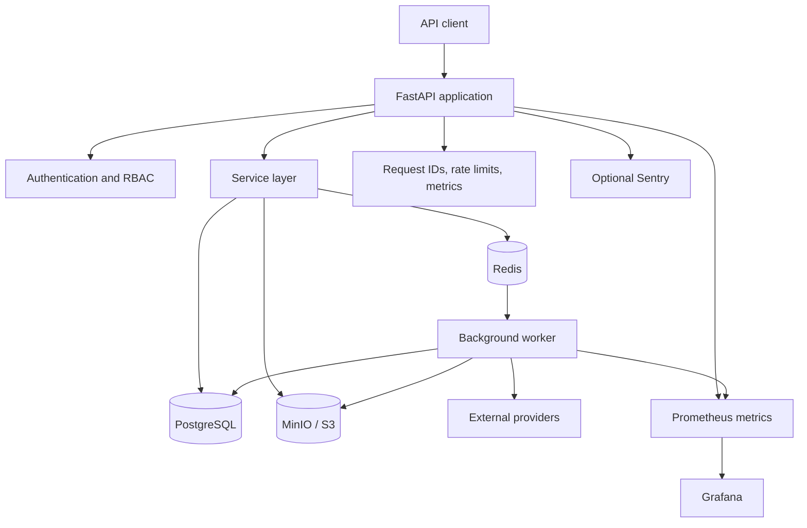
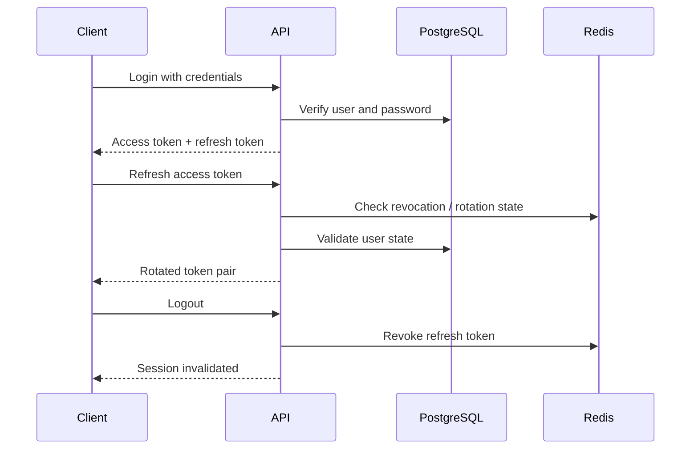
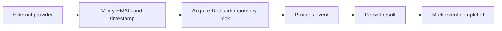
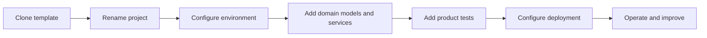

<a id="readme-top"></a>

<div align="center">

# ⚙️ FastAPI Production Foundation

### AI-ready backend foundation for production-oriented SaaS and API projects

Authentication, PostgreSQL, Redis, workers, file uploads, webhooks, observability, CI/CD and development-agent rules in one reusable template.

<br />

[](https://github.com/new?template_name=fastapi-production-foundation&template_owner=tomekmisiun)
[](PROJECT_STATUS.md)
[](docs/template-onboarding.md)

<br />

[](https://github.com/tomekmisiun/fastapi-production-foundation/actions/workflows/ci.yml)
[](https://github.com/tomekmisiun/fastapi-production-foundation/actions/workflows/dependency-review.yml)
[](https://github.com/tomekmisiun/fastapi-production-foundation/releases)
[](https://github.com/tomekmisiun/fastapi-production-foundation/commits/main)
[](https://github.com/tomekmisiun/fastapi-production-foundation)
[](https://github.com/tomekmisiun/fastapi-production-foundation/issues)

<br />


</div>

---

## Table of contents

- [About](#about)
- [What this template is](#what-this-template-is)
- [Feature matrix](#feature-matrix)
- [Architecture](#architecture)
- [Core capabilities](#core-capabilities)
- [Technology stack](#technology-stack)
- [Quick start](#quick-start)
- [Local development](#local-development)
- [Authentication](#authentication)
- [Background jobs](#background-jobs)
- [File uploads](#file-uploads)
- [Webhooks and idempotency](#webhooks-and-idempotency)
- [Observability](#observability)
- [Testing and quality](#testing-and-quality)
- [Security and tenant isolation](#security-and-tenant-isolation)
- [Deployment and operations](#deployment-and-operations)
- [Using the template](#using-the-template)
- [Project status](#project-status)
- [Repository structure](#repository-structure)
- [Documentation](#documentation)
- [Development workflow](#development-workflow)
- [Author](#author)

---

## About

**FastAPI Production Foundation** is a reusable backend foundation for SaaS and API projects.

It provides the infrastructure and engineering patterns that usually have to be rebuilt at the beginning of every production-oriented backend:

- authentication and token lifecycle,
- users and role-based access,
- PostgreSQL and Alembic migrations,
- Redis rate limiting, caching and queues,
- reliable background workers,
- file uploads to S3-compatible storage,
- verified and idempotent webhooks,
- structured logs and Prometheus metrics,
- Docker development and production examples,
- CI, security and operational workflows,
- repository rules for AI coding agents.

The project is designed to be **cloned, configured and extended**.

It is a foundation, not a finished commercial SaaS.

---

## What this template is

| It is | It is not |
|---|---|
| A tested FastAPI backend foundation | A finished SaaS product |
| A reusable architecture for APIs | A no-code application generator |
| A Docker Compose development environment | Managed hosting |
| A set of production runbooks | A replacement for cloud-provider configuration |
| A security- and test-oriented starting point | A guarantee of production readiness without adaptation |
| An AI-ready repository workflow | An autonomous auto-merge system |
| A base for multi-tenant products | A complete billing or organization-membership product |

### At a glance

| Area | State |
|---|---|
| JWT authentication and users | ✅ Included |
| PostgreSQL and Alembic | ✅ Included |
| Redis queue, cache and rate limiting | ✅ Included |
| Background worker and retries | ✅ Included |
| S3 / MinIO file uploads | ✅ Included |
| Webhook verification and idempotency | ✅ Included |
| Prometheus metrics and structured logging | ✅ Included |
| Docker development stack | ✅ Included |
| CI, release, deploy and backup workflows | ✅ Included |
| Multi-tenant isolation hooks | ✅ Included |
| Billing and subscription plans | ❌ Product-specific |
| Managed infrastructure | ❌ Consumer responsibility |

---

## Feature matrix

<table>
<tr>
<td width="50%" valign="top">

### 🔐 Authentication and users

- JWT access and refresh tokens
- refresh-token rotation
- token revocation
- password hashing
- password reset flow
- registration policy
- user CRUD
- role-based access control
- platform-admin boundaries
- audit logging

</td>
<td width="50%" valign="top">

### 🗄️ Persistence

- PostgreSQL
- SQLAlchemy 2.0
- Alembic migrations
- expand / contract migration patterns
- transaction boundaries
- database health checks
- backup and restore scripts
- migration rollback runbook
- PostgreSQL integration tests

</td>
</tr>
<tr>
<td width="50%" valign="top">

### ⚡ Redis and workers

- rate limiting
- caching
- background-job queue
- delayed jobs
- retries and backoff
- dead-letter metadata
- idempotency markers
- maintenance jobs
- Redis production contract
- queue reliability guidance

</td>
<td width="50%" valign="top">

### 📦 Files and webhooks

- direct uploads
- presigned uploads
- MinIO / S3 compatibility
- file validation hooks
- malware-scanner integration point
- HMAC webhook verification
- replay-window protection
- Redis processing locks
- idempotent event handling

</td>
</tr>
<tr>
<td width="50%" valign="top">

### 📊 Observability

- request IDs
- structured logging
- Prometheus metrics
- health and readiness endpoints
- optional Sentry integration
- local Prometheus configuration
- Grafana dashboards
- Loki log aggregation examples
- Alertmanager configuration

</td>
<td width="50%" valign="top">

### 🛡️ Delivery and security

- pytest suite and coverage gate
- Ruff and pre-commit
- Trivy scanning
- dependency review
- policy guards
- release workflow
- deploy workflow
- scheduled backups
- backup rehearsal
- load thresholds

</td>
</tr>
</table>

---

## Architecture



### Request flow

```text
HTTP request
    ↓
FastAPI route
    ↓
Authentication and authorization dependencies
    ↓
Service layer
    ↓
SQLAlchemy / Redis / object storage
    ↓
Pydantic response
```

### Layer responsibilities

| Layer | Responsibility |
|---|---|
| `app/api/` | HTTP routing, dependencies and OpenAPI behavior |
| `app/services/` | Business logic and domain errors |
| `app/models/` | SQLAlchemy persistence models |
| `app/schemas/` | Pydantic request and response contracts |
| `app/core/` | Configuration, security, middleware and metrics |
| `app/worker.py` | Background-job consumption |
| `alembic/` | Database migration history |
| `scripts/` | Deployment, backup, smoke and CI utilities |

The architecture is **sync-first** for the API. Background work is delegated to Redis workers where asynchronous execution is beneficial.

---

## Core capabilities

### Authentication lifecycle



### Multi-tenant foundation

The repository includes patterns for:

- tenant-scoped queries,
- preventing cross-tenant access,
- separating platform administration from tenant roles,
- testing tenant boundaries,
- extending the base model for product-specific membership logic.

The consumer project remains responsible for its own tenant lifecycle, billing and organization model.

### Reliable asynchronous work

```text
API operation
    ↓
Enqueue Redis job
    ↓
Worker processes job
    ↓
Success → persist result
Failure → retry with backoff
Repeated failure → record DLQ metadata
```

---

## Technology stack

### Application

<p>


</p>

### Data

<p>


</p>

### Quality and operations

<p>


</p>

### Observability

<p>


</p>

### AI development workflow

<p>


</p>

---

## Quick start

### Requirements

- Python 3.13+
- [`uv`](https://docs.astral.sh/uv/)
- Docker
- Docker Compose
- Make
- Git

### 1. Clone the repository

```bash
git clone https://github.com/tomekmisiun/fastapi-production-foundation.git
cd fastapi-production-foundation
```

### 2. Create the environment file

```bash
cp .env.example .env
```

Set a strong application secret:

```env
SECRET_KEY=replace-with-a-strong-random-secret
```

Generate one with:

```bash
python -c "import secrets; print(secrets.token_hex(32))"
```

### 3. Bootstrap the full stack

```bash
make bootstrap
```

This starts the Compose services, applies migrations, creates development data and runs smoke checks.

### 4. Run the validation gate

```bash
make validate
```

### Local resources

| Resource | Address |
|---|---|
| API | http://localhost:8000 |
| Swagger UI | http://localhost:8000/docs |
| Readiness | http://localhost:8000/health/ready |
| MinIO console | http://localhost:9001 |

### Local seeded account

```text
Email:    admin@example.local
Password: devpassword123
```

> [!WARNING]
> Change the seeded credentials before using a shared or externally accessible environment.

---

## Local development

The default workflow is Docker Compose-first.

### Main commands

| Command | Purpose |
|---|---|
| `make bootstrap` | Start services, migrate, seed and smoke-test |
| `make docker-up` | Start the Compose stack |
| `make docker-down` | Stop the Compose stack |
| `make test` | Run the pytest suite |
| `make test-coverage` | Run tests with coverage |
| `make lint` | Run Ruff |
| `make lint-fix` | Run Ruff with safe fixes |
| `make validate` | CI-equivalent lint and test gate |
| `make migration-upgrade` | Apply Alembic migrations |

### Compose-first mode

```bash
make docker-up
make test
make lint
make validate
```

### Host API mode

For faster Uvicorn reload on the host:

```bash
make install
make run
```

PostgreSQL, Redis and object storage must still be reachable.

Full command reference:

[`docs/commands.md`](docs/commands.md)

---

## Authentication

The foundation includes:

- registration policy,
- access and refresh JWTs,
- refresh-token rotation,
- token revocation,
- password reset,
- roles and permission checks,
- user lifecycle operations,
- audit events.

### Protected request

```http
Authorization: Bearer <access-token>
```

### Security boundaries

Authentication is separated into:

- credential verification,
- token creation,
- token-state validation,
- route-level authorization,
- tenant or platform boundaries.

Product-specific role and membership rules should be added in the consuming project.

---

## Background jobs

The Redis worker supports:

- queued execution,
- retry metadata,
- exponential backoff,
- delayed work,
- dead-letter information,
- maintenance jobs,
- idempotency markers.

The foundation ships reliability patterns, but your fork must define:

- concrete job types,
- business-specific retry policies,
- alert routing,
- provider credentials,
- operational SLOs.

See [`docs/worker-reliability.md`](docs/worker-reliability.md).

---

## File uploads

The upload foundation supports:

- API-mediated uploads,
- presigned S3-compatible uploads,
- MinIO for local development,
- file-size and content validation hooks,
- metadata persistence,
- production malware-scanner integration points.

Production deployments must provide a real malware-scanning service when the configured validator requires one.

See [`docs/file-upload-production.md`](docs/file-upload-production.md).

---

## Webhooks and idempotency

Webhook handling includes:

- HMAC verification,
- replay-window validation,
- idempotency keys,
- Redis processing locks,
- duplicate-event protection,
- explicit failure handling.



See [`docs/webhook-idempotency.md`](docs/webhook-idempotency.md).

---

## Observability

### Built-in signals

| Signal | Included |
|---|---|
| Request IDs | ✅ |
| Structured application logs | ✅ |
| Prometheus metrics | ✅ |
| Liveness and readiness | ✅ |
| Optional Sentry hook | ✅ |
| Local Grafana examples | ✅ |
| Local Loki examples | ✅ |
| Provider-specific alert routing | Consumer responsibility |

### Local observability stack

```bash
docker compose \
  -f docker-compose.yml \
  -f docker-compose.observability.yml \
  up -d
```

See [`docs/observability-production.md`](docs/observability-production.md).

---

## Testing and quality

The verified baseline contains approximately:

```text
374 pytest tests
~88% line coverage
85% required coverage floor
```

### Run tests

```bash
make test
```

### Run coverage

```bash
make test-coverage
```

### Run the complete gate

```bash
make validate
```

### Quality controls

- Ruff linting
- pytest regression suite
- branch coverage collection
- 85% coverage floor
- pre-commit hooks
- migration tests
- tenant-isolation tests
- Docker image build checks
- Trivy scanning
- dependency review
- policy guards
- load-threshold workflows

---

## Security and tenant isolation

The template includes safeguards and extension points for:

- secret handling,
- password security,
- token revocation,
- rate limiting,
- webhook verification,
- upload validation,
- audit logs,
- tenant-scoped data access,
- platform-admin separation,
- deprecated route policy.

Security documentation:

- [`docs/secret-management.md`](docs/secret-management.md)
- [`docs/tenant-isolation.md`](docs/tenant-isolation.md)
- [`docs/platform-admin-model.md`](docs/platform-admin-model.md)
- [`docs/malware-scanning.md`](docs/malware-scanning.md)

> [!IMPORTANT]
> A consumer project must still define its own domain authorization rules and verify them with application-specific tests.

---

## Deployment and operations

The repository provides reusable workflows and runbooks rather than one mandatory hosting platform.

### Included workflows

| Workflow | Purpose |
|---|---|
| `ci.yml` | Main validation and test pipeline |
| `dependency-review.yml` | Dependency-change security review |
| `deploy.yml` | Deployment workflow example |
| `release.yml` | Release automation |
| `scheduled-backup.yml` | Scheduled backup workflow |
| `backup-rehearsal.yml` | Restore and backup rehearsal |
| `load-threshold.yml` | Performance-threshold checks |

### Production responsibilities

Your fork must configure:

| Area | Consumer responsibility |
|---|---|
| Hosting | Kubernetes, PaaS, VM or another runtime |
| Secrets | Secret manager, rotation and environment policy |
| PostgreSQL | Managed database, backups and recovery objectives |
| Redis | HA strategy and persistence requirements |
| Object storage | Real S3-compatible provider |
| Alerting | Slack, PagerDuty or another on-call route |
| Tracing | Sentry, OpenTelemetry or equivalent |
| Malware scanning | Concrete production scanner |
| Product policy | Roles, billing, registration and tenant lifecycle |

Deployment documentation:

- [`docs/production-deployment.md`](docs/production-deployment.md)
- [`docs/production-runtime-examples.md`](docs/production-runtime-examples.md)
- [`docs/migration-rollback.md`](docs/migration-rollback.md)
- [`docs/database-backup-restore.md`](docs/database-backup-restore.md)

---

## Using the template

Recommended adoption flow:



### First changes in a new project

1. Update the project name and metadata.
2. Rotate all secrets.
3. Define the product's user and tenant model.
4. Remove unused example capabilities.
5. Add domain models and migrations.
6. Configure application-specific validation.
7. Choose managed PostgreSQL, Redis and object storage.
8. Configure deployment and alerting.
9. Replace development seed credentials.
10. Run the complete validation gate.

Start with:

[`docs/template-onboarding.md`](docs/template-onboarding.md)

---

## Project status

The template's core roadmap milestones are complete.

| Milestone | Status |
|---|---|
| P0 — production blockers | ✅ Complete |
| P1 — adoption hardening | ✅ Complete |
| P2 — scale and maintainability | ✅ Complete |
| P3 — enterprise-scale optional work | 🧭 Not started |
| Template freeze | ✅ Ready |
| Verified test baseline | ✅ 374 tests |
| Coverage gate | ✅ 85% |
| Open technical debt | 🟡 Tracked in `TECH_DEBT.md` |

The project is suitable as:

- a reusable backend foundation,
- a production-oriented portfolio project,
- a starting point for a SaaS API,
- a reference implementation for testing and operational patterns.

It should not be presented as a fully configured production platform without adapting the infrastructure and product policy.

See:

- [`PROJECT_STATUS.md`](PROJECT_STATUS.md)
- [`ROADMAP.md`](ROADMAP.md)
- [`TECH_DEBT.md`](TECH_DEBT.md)
- [`TEMPLATE_FREEZE_CHECKLIST.md`](TEMPLATE_FREEZE_CHECKLIST.md)

---

## Repository structure

```text
.
├── app/
│   ├── api/                 # Routes, dependencies and OpenAPI helpers
│   ├── core/                # Config, security, middleware and metrics
│   ├── models/              # SQLAlchemy models
│   ├── schemas/             # Pydantic contracts
│   ├── services/            # Business logic and domain errors
│   └── worker.py            # Background worker
├── alembic/                 # Database migrations
├── tests/                   # Unit, integration and regression tests
├── scripts/                 # CI, deploy, backup and smoke utilities
├── observability/           # Prometheus, Grafana and Loki examples
├── perf/                    # Load-test baselines
├── docs/
│   ├── adr/                 # Architecture decisions
│   ├── specs/               # Specifications
│   └── *.md                 # Runbooks and operational guides
├── .ai-rules/               # Binding AI-development rules
├── .cursor/rules/           # Cursor adapters
├── .commands/               # Reusable agent prompts
├── agents/                  # Optional review personas
├── .github/workflows/       # CI, deploy, release and backup workflows
├── docker-compose.yml       # Development stack
├── docker-compose.prod.yml  # Production-oriented example
├── Dockerfile
├── Makefile
└── pyproject.toml
```

---

## Documentation

### Getting started

| Document | Purpose |
|---|---|
| [`docs/template-onboarding.md`](docs/template-onboarding.md) | Clone-to-first-deploy onboarding |
| [`docs/template-usage.md`](docs/template-usage.md) | Quick template usage |
| [`docs/commands.md`](docs/commands.md) | Full Makefile command reference |
| [`docs/troubleshooting.md`](docs/troubleshooting.md) | Common local and CI issues |

### Production and data

| Document | Purpose |
|---|---|
| [`docs/production-deployment.md`](docs/production-deployment.md) | Production operating model |
| [`docs/migration-rollback.md`](docs/migration-rollback.md) | Migration rollout and rollback |
| [`docs/database-backup-restore.md`](docs/database-backup-restore.md) | Backup and restore |
| [`docs/pitr-and-scheduled-backups.md`](docs/pitr-and-scheduled-backups.md) | PITR and scheduled backups |
| [`docs/redis-production-contract.md`](docs/redis-production-contract.md) | Redis production requirements |

### Security and reliability

| Document | Purpose |
|---|---|
| [`docs/tenant-isolation.md`](docs/tenant-isolation.md) | Tenant scoping and cross-tenant tests |
| [`docs/webhook-idempotency.md`](docs/webhook-idempotency.md) | Webhook verification patterns |
| [`docs/file-upload-production.md`](docs/file-upload-production.md) | Upload architecture and security |
| [`docs/worker-reliability.md`](docs/worker-reliability.md) | Retry and worker reliability |
| [`docs/observability-production.md`](docs/observability-production.md) | Logging, metrics and tracing |

### AI-assisted development

| Document | Purpose |
|---|---|
| [`docs/ai-workflows.md`](docs/ai-workflows.md) | Rules, personas and commands |
| [`docs/two-agent-review-workflow.md`](docs/two-agent-review-workflow.md) | Builder / Reviewer workflow |
| [`AGENTS.md`](AGENTS.md) | Codex CLI entry point |
| [`CLAUDE.md`](CLAUDE.md) | Claude Code entry point |
| [`.ai-rules/`](.ai-rules/) | Binding repository rules |

---

## Development workflow

```text
Define one logical task
        ↓
Create a feature branch
        ↓
Implement a focused vertical slice
        ↓
Run targeted tests
        ↓
Run make validate
        ↓
Perform independent review
        ↓
Open a pull request
        ↓
Merge only after approval
```

### Repository rules

- one logical task per branch,
- Conventional Commits,
- no unrelated refactors,
- migrations for database changes,
- tests for new behavior and regressions,
- full validation before merge,
- no AI attribution trailers,
- no commit, push or merge without explicit approval in agent workflows.

Read:

- [`AGENTS.md`](AGENTS.md)
- [`CLAUDE.md`](CLAUDE.md)
- [`.ai-rules/`](.ai-rules/)

---

## Author

<div align="center">

### Tomasz Misiun

[](https://github.com/tomekmisiun)
[](https://misiun.dev)

<br />

Built as a reusable foundation for production-oriented FastAPI systems.

</div>

---

<div align="center">

**Clone. Configure. Extend. Validate. Ship.**

[Back to top](#readme-top)

</div>
